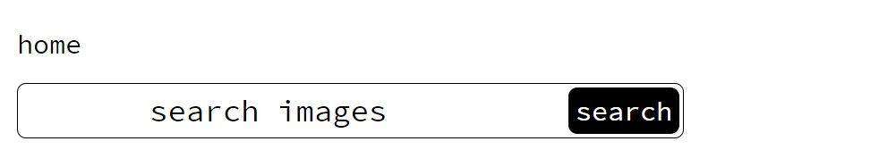
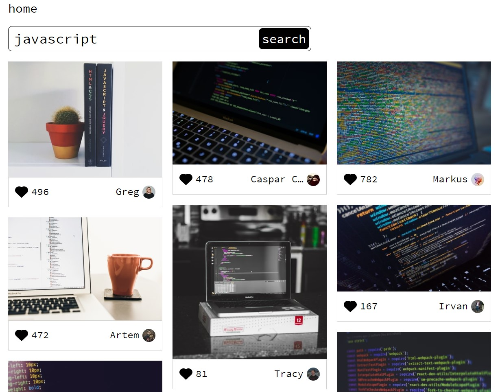

<h1 align="center">
    
</h1>

    
    

# 📷Infinity Image Gallery React

Ссылка на проект в gh-pages: **[📷Infinity Image Gallery React GH pages](https://comediant24.github.io/infinity-gallery-react/)**

## ✍🏻 Краткое описание проекта

#

При стартовой загрузке страницы посылается асинхронный запрос на `/photos/random` `API Unsplash`, для получения рандомных фото и заполнения компонента поисковой выдачи. Затем уже поисковые запросы обращаются к `/search/photos`. Для асинхронных запросов используется синтаксис `async/await`, обрабатываются ошибки в `try..catch`. Из полученного массива берутся данные и наполняется компонент `Card`. Для вывода сетки используется пакет `react-responsive-masonry` - гибкие настройки позволяют добиться удивительных результатов! Изначально, массив получаемый по `/search/photos` имеет длину в 10 карточек. В проекте его длина увеличивается за счет параметра `page` GET запроса к `/search/photos`. Этот параметр управляется одноименным стейтом. `imageCards` - стейт, который хранит в себе карточки полученные get запросом `/search/photos` заполняется при увилечении стейта `page`. Вызов функции увеличиваюший `page` происходит компонентом `InfiniteScroll` предоставленный `npm` пакетом `react-infinite-scroll-component`. Стили управляются `styled-components`.

## 📖 Задачи

#

Поработать с `API Unsplash`, попрактиковаться в использовании `npm пакетов для React`, создать свой первый макет в `Figma`

## 📹 Интерфейс поисковой выдачи

#

## 🧰 Инструменты

#

- HTML, CSS
- Javascript
- React, React hooks
- React responsive masonry
- React infinite scroll component
- Styled components

## 🆕 Будущие обновления

#

- [ ] Хранить последний запрос пользователя в localStorage
- [ ] Настроить роуты для карточек
- [ ] Создать главную страницу

## 💻 Установка зависимостей

#

##### `yarn install` – установить зависимости проекта

##### `yarn start` – запуск devServer на http://localhost:3000/

##### `yarn build` – production сборка проекта
